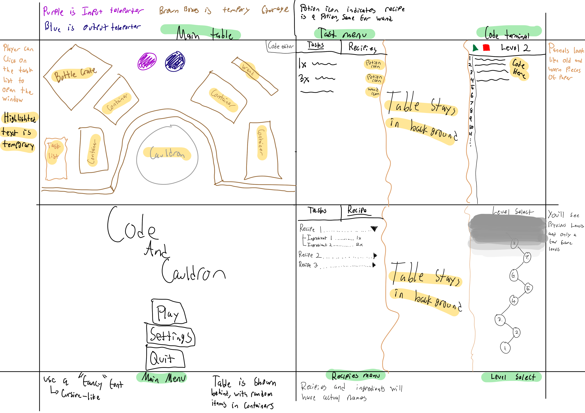

# Code and Cauldron

## Elevator Pitch

You're a wizard's apprentice and you need to write assembly code to cast their spells and create potions, given materials such as: a wand, a cauldron, empty bottles, and magical ingredients.

## Influences (Brief)

- Waltz of the Wizard:
  - Medium: Game
  - Explanation: The design of Waltz of the Wizard is extremely unique and perfectly represents the wizard aesthetic. In the game you are a wizard who can explore the tower and create different spells that can be used for fun. There is also a "story" where you need to complete tasks around the tower to unlock new areas of the game, and you learn new lore about the game.
- Factorio:
  - Medium: Game
  - Explanation: Factorio is one of the most popular automation games currently. You are an engineer who crash lands on a planet and you need to esape by building a rocket. This is of course very expensive and requires lots of research and materials, so you must automate everything to speed up to progress

## Core Gameplay Mechanics (Brief)

- Adding ingredients into a cauldron
- Sending completed potions/spells to the wizard
- Editing and running assembly code
- Recieving list of potions/spells from the wizard that need to be crafted

# Learning Aspects

## Learning Domains

Introduction to Assembly programming

## Target Audiences

College or high school students who are majoring in computer science and want to learn assembly language.

## Target Contexts

This game can be used to help students who are in assemebly langauge courses. It can be used as a tool in the classroom or a game students can play outside of school to get a grasp of programming in assembly.

## Learning Objectives

- Write Assembly: By the end of the lesson, students will be able to write basic assembly code
- Step through Assembly: By the end of instruction, students will be able to step through x86 assembly code and understand what it will do
- Explain Assembly: By the end of instruction, students will be able to explain the basics of x86 registers and how basic instructions will work

## Prerequisite Knowledge

- Prior to the game, players need to understand the flow of programs and how they run
- Prior to the game, players need to have basic assembly knowledge of the syntax and how assembly code works, but the player will be guided through it in the first level

## Assessment Measures

Assessment is measured based on completion of levels, and how efficient your code is. Slower running/code with lots of extra lines will result in a lower score and star rating on the completed level, where three stars is very effieient.

# What sets this project apart?

- Old School wizard aesthetic is rare in modern games
- A new way of automating tasks
- Combing wizards and coding is something that hasn't been done too much
- Simple to learn but gets difficult very fast

# Player Interaction Patterns and Modes

## Player Interaction Pattern

This game is for one person, they write code in a terminal, and use the mouse to select different menus.

## Player Modes

Has one player mode.

- Single-Player: You'll complete levels where the first few are pre-made to learn the basics, then all other levels will be procedurally generated

# Gameplay Objectives

- Please the wizard:
    - Description: The player will write code in order to access the needed ingredients for the potion/spells that the wizard wants.
    - Alignment: This objective has the player writing and walking through assembly code, and after playing multiple levels, the player will be able to explain their own assembly code.
- Advance to the next level:
    - Description: After giving the wizard the correct potions/spells, he will be pleased with your work and give you slightly more advanced tasks.
    - Alignment: The player's assembly writing skills will advance as the levels get more complex
- Complete as many levels as possible
    - Description: The game has an infinite amount of levels to complete.
    - Alignment: The player will be able to practice and maintain their assembly skills for as long as they would like.

# Procedures/Actions

You can select menus like the code editor or the task scroll. You can input text into the editor in the built in code editor.

# Rules

- If the player creates an invalid potion, a puff of smoke will appear indicating it was invalid.
- If the player correctly sends the wizard the required potions, a sound will play indicating so.
- If the player sends the wizard the incorrect potions, a glass breaking sound will play and they will lose the level.
- Over time the player will unlock new features
    - More complex potions
    - Spells to change the potion
    - More ingredients
    - New instructions to use
    - Intermediate ingredients 

# Objects/Entities

- Main cauldron with liquid that changes color based on the ingredients
- Small containers to store items temporarily
- Wooden crate of empty glass potion bottles
- Wooden wand
- Simple text editor to write code in
- Scroll with list of tasks that need to be completed
- Old book that contains recipies and learned instructions
- Level select tab in the menu, with all levels completed and the next not-yet unlocked level
- Title screen with the title, play button, and a simple options menu

## Core Gameplay Mechanics (Detailed)

- Editing and Running Assembly Code: There will be a button on the main screen of the game to take the player to a seperate tab/page. This tab will have a text editor, run/pause button, and hint button. This is where the player will type out their code (based on recipie) and run it. Once the code is running, if there are any syntax errors then error message is displayed. Otherwise, the spell/potion gets made according to the code. Then, the potion/spell gets sent to the main wizard for approval. If correct, level will be completed; otherwise, the player fails the level and will get yelled at by the wizard. The player will be able to edit and run their code until the correct potion/spell is made.
- Adding Ingredients into Cauldron: There will be a cauldron in the middle of the room that starts out with a basic blue water base, but as the player adds ingredients to the cauldron, it will change color. The cauldron is how the player will make potions using the ingredients given to them by the wizard. The player will simply click and drag the ingredient, and if they player releases the item while hovering over the cauldron, it will go into it. The player can brew what is in the cauldron to create a potion.
- Sending Potions/Spell to the Wizard: There will be two teleporters placed towards the top of the screen, one input and one output. The input teleporter will give the player materials that will be used to create potions. The output teleporter will be used to send completed potions to the wizard after they have been created. The player will have to properly manage the input so they do not overflow the teleporter, if this happens they will lose the level. If the wizard doesnt recieve all required potions by the end of the code's execution, then the wizard will get angry and the player will lose the level.
    
## Feedback

If the player is unsuccessful in creating the potions or casting the spells then the main wizard will sometimes yell at the player. One of the audios will be the wizard yelling at the player for the incorrectly made item. Other times when the player fails, clashing/breaking sounds will come from off screen to sense that the spell or potion was made incorrectly.

In the longer term, every three attempts per level the player will get a hint from the wizard about what the answer should be. This way they get an idea on where they are messing up and can improve. However, if more than 1 hint is used, the player will lose score and not be able to get 3 stars.

# Story and Gameplay

## Presentation of Rules

Text is displayed at the start of levels that describe what is required of the player. Text will also be displayed when first opening the terminal to explain the interface and instructions.

## Presentation of Content

The player will be taught how to code in assembly through the tutorial phase in which the first few potions/spells will be premade for the user to examine and mess with. The tutorial missions will allow the user to see how different pieces of assembly code work and interact with each other.

## Story (Brief)

You're a wizards apprentice and you need to create his spells and potions for him. You'll gain harder and harder tasks as you gain his trust as an up and coming wizard.

## Storyboarding

# Assets Needed

## Asethestics

The primary display of the game will be a wizard's cabin. A room inside a wooden cabin with a big cauldron in the center. Multiple wooden shelves holding the ingredients and glass bottles. Bubbles and smoke coming out of the cauldron when potions are being made. Books and scrolls left out and about around the cabin. A wooden (Harry Potter Style) wand on one of the shelves. The whole atmosphere will be in a dim-lit room and darker/intense colors of the ingredients or potions. The player should feel that they are in a cozy, magical place.

## Graphical

- Characters List
  - Wizards Apprentice (player)
  - The Main Wizard

- Textures:
  - Wooden and Glass
  - Grainy, Melting Wax
  
- Environment Art/Textures:
  - Smooth Stone Circular Cauldron
  - Odd Shaped Glass Beakers and Test Tubes
  - Carved Wooden Wand

## Audio

- Music List (Ambient sound)
  - General gameplay: Calm but upbeat, medieval style music like [Old Runescape Soundtrack: Venture](https://youtu.be/bjxK0GQeA-c?si=WDR47aSo9OoaDIjG)

- Sound List (SFX)
  - Player giving the wrong potion: Bottle breaking sound effect
  - Player adding ingredients to the cauldron: Bubbling water sound effect
  - Player giving the wrong spell: Angry man sound effect
  - Player giving the right potion/spell: Man laughing sound effect
  - Player flips through old recipe book: Page flipping sound effect

# Metadata

* Template created by Austin Cory Bart <acbart@udel.edu>, Mark Sheriff, Alec Markarian, and Benjamin Stanley.
* Version 0.0.3

